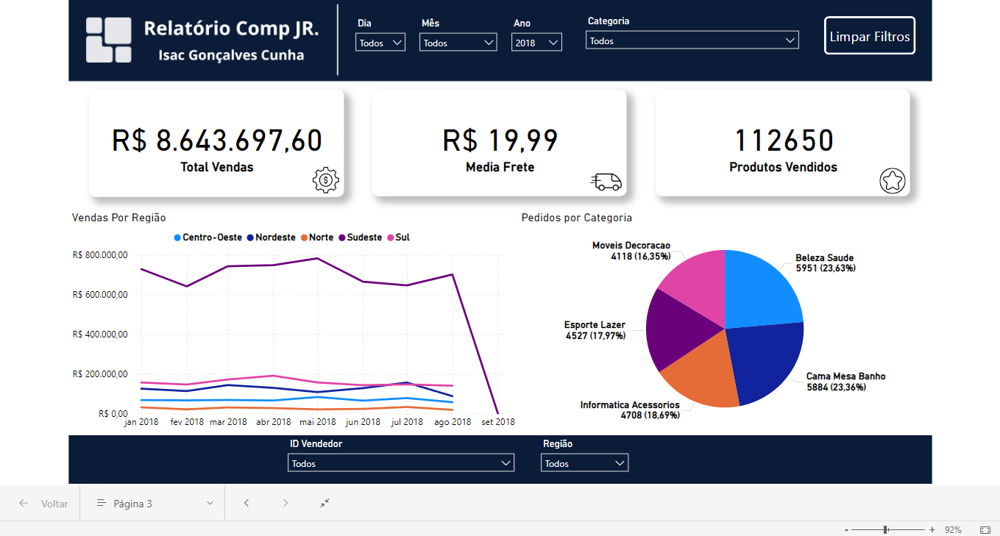

# Projeto de Análise de Dados Comp Júnior

## Descrição
- Esse projeto foi desenvolvido para o processo seletivo da Comp Júnior, com intuito de melhorar e demonstrar minhas habilidades na área ánalise de dados.

## Recursos
- O projeto é composto de 4 etapas, sendo elas Excel, SQL, Power BI e Python.
- Cada uma das etapas tinha perguntas de négocio individuais sobre alguns dados que nos foram enviados.

## Etapas

Descrição de cada etapa do projeto:

### 1. Excel
Foram enviadas 10 perguntas de négocio ou formatação, juntamente com os dados, em uma planilha que você pode encontrar [aqui](https://docs.google.com/spreadsheets/d/1aVX1cy3Jxpvos4M4y37QUEKFMgcYcOwO/edit?u%20sp=sharing#gid=217986317).

- Para as perguntas de formatação: foi utilizada a função substituir do excel.
- Para as perguntas de negócio: foram utilizadas de tabelas dinâmicas ou fórmulas simples de média e contagem.

Cada resposta está em uma página da [planilha de respostas](./respostas-pergunta-excel.xlsx).

### 2. SQL
Recebi os [dados](https://drive.google.com/file/d/1uI7qAjt6qJsh_V4IYUQ82y8Yr_OILTjQ/edit) em SqlLite e as seguintes perguntas:

1: Qual é a receita total gerada por categoria de produto?
Resposta: 

2: Qual é o tempo médio de entrega dos produtos, por estado?
Resposta:

3: Quais são os top 10 clientes em termos de valor gasto (aqueles
que gastaram mais)?
Resposta:

4: Qual a variação percentual das vendas mensais, comparado ao
mês anterior, por categoria?
Resposta:

5: Quais os 5 vendedores que têm o maior número de pedidos
cancelados? 
Resposta:

6: Quais os estados que tiveram a maior relação
“Número de Pedidos”/”Tempo médio de entrega”?
Resposta:

Para todas as perguntas foram criadas queries sql com seleções, uniões e agrupamentos básicos, buscando sempre uma tabela que respondêsse as perguntas.

### 3. Power BI
Utilizando os mesmos [dados](https://drive.google.com/file/d/1uI7qAjt6qJsh_V4IYUQ82y8Yr_OILTjQ/edit), foi feito um [dashboard](https://app.powerbi.com/view?r=eyJrIjoiNjljOTcyZDYtNWExYi00NDQ0LWI1NjItNjg0MzYyMGRhYzBjIiwidCI6IjkxZDViYjA2LTY5NzAtNDQ2OC1hZTRjLTZmZjRjYWY5OTQyMyJ9) em Power BI, com as seguintes exigências:

Gráficos
- Gráfico de Barras com as vendas totais por mês.
- Gráfico de Linhas com o valor do pedido médio (AOV - Average Order Value) ao longo do tempo.
- Gráfico de Pizza com o valor total de pedidos por gênero.
- Gráfico de linha com a performance de vendas por região ao longo do tempo. 
- Indicador com o total de vendas por ano.
- Indicador com a taxa média de frete.
- Indicador com o número total de produtos vendidos (quantidade de produtos vendidos).

Filtros
- Por Data (Seleção de intervalo de datas (dia, mês, ano))
- Por Categoria de Produto (lista dropdown)
- Por vendedor (lista dropdown com o nome ou ID dos vendedores) 
- Por região (lista dropdown com as regiões de entrega)

O dashboard final ficou com 3 cartões fixos,
correspondentes aos indicadores pedidos.  
Ele também conta com 6 seletores fixos, para cada um dos filtros.  
Os outros 4 gráficos, estão dividos em 3 páginas diferente do [dashboard](https://app.powerbi.com/view?r=eyJrIjoiNjljOTcyZDYtNWExYi00NDQ0LWI1NjItNjg0MzYyMGRhYzBjIiwidCI6IjkxZDViYjA2LTY5NzAtNDQ2OC1hZTRjLTZmZjRjYWY5OTQyMyJ9).

**Vale ressaltar** que nos dados recebidos, não havia informações sobre região, apenas estaddo. Portanto realizei um WebScrapping em um site com uma tabela
de estados e regiões, que você pode acesssar [aqui](https://www.doutoresdoexcel.com.br/relacao-estados-e-regioes-curso-power-bi/).

**Lembrando também** que não haviam informações sobre gênero (masulino, femenino, entre outros) nos dados. Portanto interpretei como gênero, a categoria de cada produto.
  
O link público de acesso ao dashboard é:  
https://app.powerbi.com/view?r=eyJrIjoiNjljOTcyZDYtNWExYi00NDQ0LWI1NjItNjg0MzYyMGRhYzBjIiwidCI6IjkxZDViYjA2LTY5NzAtNDQ2OC1hZTRjLTZmZjRjYWY5OTQyMyJ9  

### 4. Python
Foi enviado o seguinte [Notebook](https://drive.google.com/file/d/1IcJ2pBmdAhkE6a9Lph9lb_ObY6aGhCpN/view), com vários exercícios, baseadas nos dados das seguintes [tabelas](https://drive.google.com/file/d/1IcJ2pBmdAhkE6a9Lph9lb_ObY6aGhCpN/view).

Exercício 1:

    Na sua primeira tarefa como analista de dados na Comp Júnior, você precisa combinar informações de diferentes fontes para uma visão holística.
    Carregue os datasets de clientes, pedidos e produtos usando o Pandas e crie um único DataFrame unificando esses dados por suas chaves relevantes (customer_id, order_id).
    Apresente as primeiras cinco linhas do DataFrame resultante para verificação e atribua os seguintes nomes às respectivas tabelas:

    olist_customers_dataset: customer_df
    olist_orders_dataset: orders_df
    olist_order_items_dataset: items_df
    Tabela única: df

Exercício 2:

    Dados precisos são cruciais para uma análise eficaz. Identifique e trate valores ausentes ou duplicados nos datasets de clientes e pedidos.         
    Explique sua abordagem e justifique as decisões tomadas para o tratamento desses dados.

Exercício 3:

    Como parte do seu relatório mensal, você precisa fornecer um resumo estatístico dos preços dos produtos. 
    Utilize o método describe() do Pandas para detalhar a distribuição dos preços, destacando possíveis outliers e sua possível influência no cálculo da média.

Exercício 4:

    A eficiência logística é vital para a satisfação do cliente. 
    Adicione uma coluna ao DataFrame de pedidos que calcule o número de dias entre a data de compra e a data de entrega. Discuta como variações nesse prazo podem impactar a percepção do cliente.

Exercício 5:

    Visualizações claras podem revelar tendências que antes não eram possíveis de serem capturadas. Crie um gráfico de barras vertical que mostre o volume de vendas mensal por estado. 
    Use essa visualização para identificar quais estados apresentaram maior crescimento no último ano.

Exercício 6:

    Para incentivar uma competição saudável entre os vendedores, você decide analisar o desempenho individual. 
    Calcule e visualize o total de vendas por vendedor usando um gráfico de barras horizontal no Matplotlib, destacando o vendedor com maior volume de vendas.

Exercício 7:

    Entender a dinâmica de preços é crucial para estratégias de marketing. 
    Utilize Numpy para calcular a média, mediana e desvio padrão dos preços dos produtos, discutindo como essas métricas podem ajudar na definição de estratégias de precificação.

Exercício 8:

    A precisão nas previsões de entrega é um indicador chave de desempenho logístico. 
    Desenvolva um método para comparar as datas estimadas e reais de entrega, identificando padrões de atrasos ou adiantamentos nas entregas. 
    Faça um gráfico de linhas com o tempo médio de atraso por semana ao longo do tempo. O eixo y deve ser o tempo médio de atraso (em dias) e o eixo x as semanas do ano.

Exercício 9:

    Investigue a relação entre o valor do frete e o preço dos produtos. 
    Calcule a correlação entre esses dois fatores e crie um scatter plot para visualizar essa relação, discutindo como isso pode afetar as decisões de frete grátis.

Exercício 10:

    Análises de feedback de clientes são essenciais para melhorias. 
    Agrupe os dados de pedidos por avaliação média e calcule o volume de vendas para cada grupo, usando um gráfico de linha para mostrar a tendência de vendas em relação às avaliações.

Exercício 11:

    Com o fim do mês se aproximando, você precisa preparar e exportar os dados analisados para um relatório em formato CSV. 
    Exporte o DataFrame final que inclui todos os dados e cálculos realizados, garantindo que esteja pronto para uso em outros softwares de análise.

Para responder as perguntas utilizei das bibliotecas Pandas, Numpy, Matplotlib e Seaborn

**Observação**: para o exercício 10, houve a necessidade de utilizar da tabela de reviews, envidada nas etaps de SQL e Power BI.

## Conclusão
- O projeto me auxiliou no desenvolvimento de habilidades na Ánalise de Dados. Por meio deste projeto, é visível a importância desta área na tomada de decisões, seja no âmbito pessoal ou profissional.

#### Desenvolvido por Isac Gonçalves Cunha
